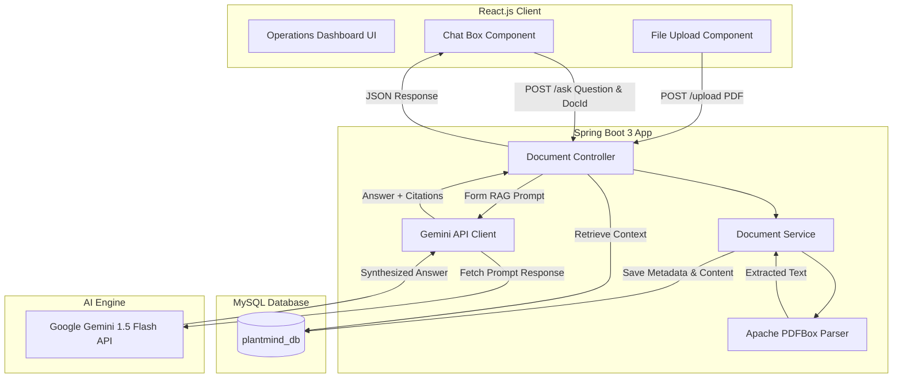

# PlantMind AI – Unified Asset & Operations Brain

PlantMind AI is an Industrial Knowledge Intelligence Platform built for industrial engineers, maintenance operators, and technicians. It implements **Retrieval-Augmented Generation (RAG)** to index technical documents, machinery manuals, lock-out/tag-out (LOTO) protocols, and calibration guides, serving as a unified brain for plant operations.

## Key Features
* **Industrial Document Ingestion**: Process technical PDF documents on the fly using Apache PDFBox.
* **Unified Asset Database**: Metadata and text contents are stored in a structured MySQL schema.
* **Operational RAG Interface**: Contextual industrial troubleshooting using Google Gemini 1.5 Flash.
* **Granular Context Scoping**: Query the entire plant database index or target a specific machinery manual.
* **Industrial Operations Dashboard**: Modern operations UI with telemetry status checks, interactive citations, and sample operational prompts.

---

## System Architecture



---

## Tech Stack
* **Frontend**: React.js 19, Axios, HTML5, Vanilla CSS3 (Custom design system).
* **Backend**: Spring Boot 3.3.0, Java 17, Spring Data JPA.
* **Database**: MySQL.
* **Document Parser**: Apache PDFBox 2.0.30.
* **AI Engine**: Google Gemini API (REST Endpoint Integration).
* **Build Tool**: Maven.

---

## Setup Instructions

### 1. Database Setup (MySQL)
Ensure you have a running MySQL instance. 

1. Connect to MySQL via your preferred CLI or GUI tool and run the following command to create the database:
   ```sql
   CREATE DATABASE plantmind_db;
   ```
2. The Spring Boot backend is configured to automatically create the required database tables on startup. If you wish to inspect the schema, you can refer to the [schema.sql](schema.sql) file:
   ```sql
   USE plantmind_db;
   CREATE TABLE IF NOT EXISTS documents (
       id BIGINT AUTO_INCREMENT PRIMARY KEY,
       file_name VARCHAR(255) NOT NULL,
       upload_date DATETIME NOT NULL,
       content LONGTEXT
   ) ENGINE=InnoDB DEFAULT CHARSET=utf8mb4;
   ```

---

### 2. Google Gemini API Key Setup
You need a Gemini API Key to run the AI features.

1. Go to [Google AI Studio](https://aistudio.google.com/) and obtain a free Gemini API key.
2. Set the key as an environment variable in your terminal before launching the backend:
   ```bash
   export GEMINI_API_KEY="your-actual-api-key-here"
   ```
   *Alternative*: Open the [application.properties](src/main/resources/application.properties) file and paste the API key directly:
   ```properties
   gemini.api.key=your-actual-api-key-here
   ```

---

### 3. Run Backend (Spring Boot)
Ensure Java 17 is active in your terminal.

1. Navigate to the project root directory.
2. Build the project using Maven:
   ```bash
   ./mvnw clean package -DskipTests
   ```
3. Run the Spring Boot application:
   ```bash
   ./mvnw spring-boot:run
   ```
   The backend server will launch and listen on port `8080`.

---

### 4. Run Frontend (React.js)
1. Open a new terminal session and navigate to the frontend folder:
   ```bash
   cd plantmind-ui
   ```
2. Install npm dependencies (Axios is pre-configured):
   ```bash
   npm install
   ```
3. Launch the development server:
   ```bash
   npm start
   ```
   The frontend application will open automatically in your browser at `http://localhost:3000`.

---

## Verification & Testing Guide

1. Open the [machinery_manual_text.txt](sample-data/machinery_manual_text.txt) file inside the `sample-data` folder.
2. Open the file in your browser or text editor, and print/save it as a PDF named `machinery_manual.pdf`.
3. In the PlantMind AI dashboard:
   - Drag & drop the `machinery_manual.pdf` file into the ingestion box, then click **Extract & Index Document**.
   - After a success message, click **Refresh** on the "Indexed Documents" section to see the document list.
4. Interact with the chat box:
   - Click one of the suggestions, such as: *"BFP-02 pump exhibits high vibration. Suggest troubleshooting steps."*
   - Target the query to `machinery_manual.pdf` using the Target Brain dropdown.
   - Click Send and view the synthesized response referencing the specific source.
